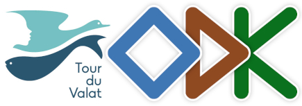
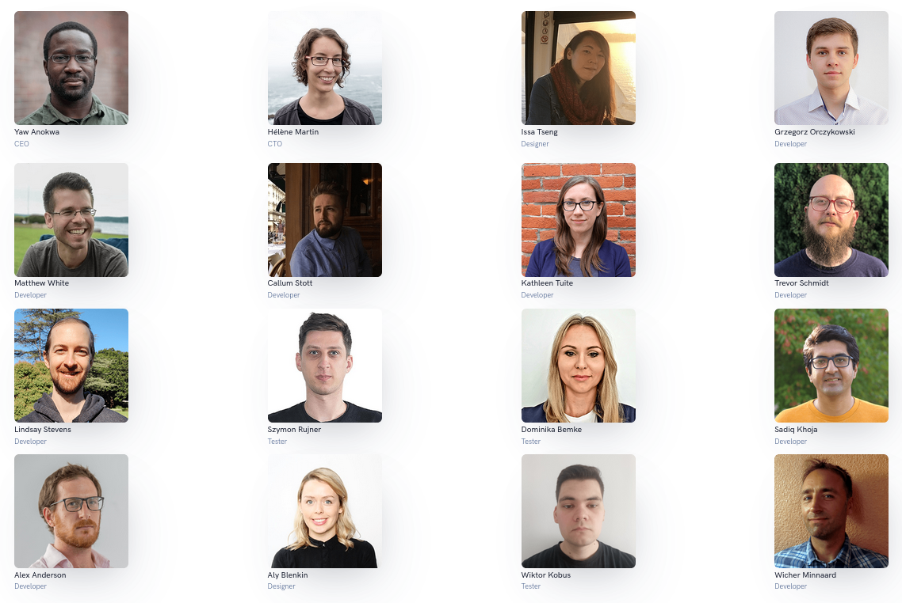
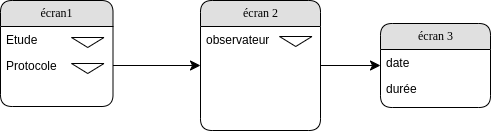
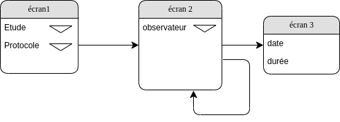
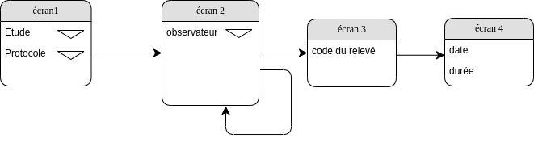
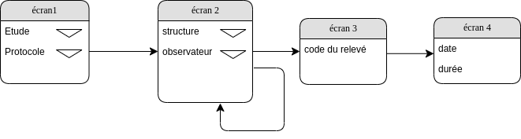
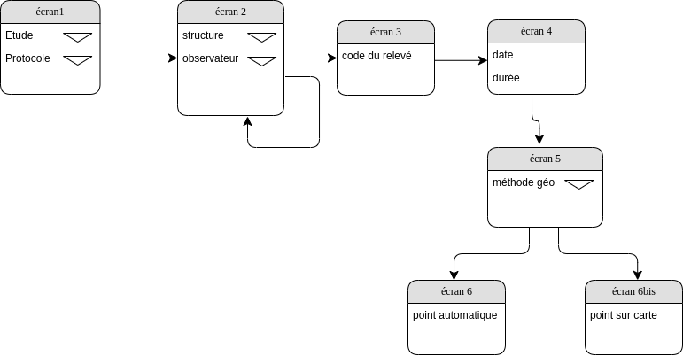
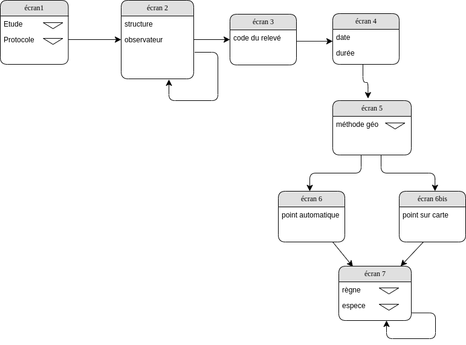

# Formation ODK - Tour du Valat



Mathieu Bossaert, Le Sambuc, les 2, 3 et 4 décembre 2024
### Programme prévisionnel

| demi-journée | Planning proposé                 | Planning proposé                                                |
|--------------|----------------------------------|-----------------------------------------------------------------|
| 1            | présentation d’ODK               | Central / Collect / WebForms (enketo)                           |
|              | La communauté                    | Forum & Github                                                  |
|              | XlsForm                          | Logique et types de question                                    |
| 2            | TP                               | Travaux pratiques logiques de formulaire et types de question   |
| 3            | Développement                    | Formulaire IWC                                                  |
| 4            | Développement                    | Formulaire IWC                                                  |
| 5            | Optimisation                     | Listes de choix, logique, last-saved...                         |
| 6            | Récupération des données en base | Dans PostgreSQL avec Central2PG + présentation des alternatives |

## ODK
### L'équipe


### La communauté
[https://forum.getodk.org](https://forum.getodk.org)
## Les outils
ODK Central est le serveur. Il organise les formulaires, gère les utilisateurs et leurs droits d'accès, diffuse les formulaires vierges aux terminaux qui utilisent ODK Collect, et il reçoit et centralise les données collectées.
### Présentation des fonctionnalités d'ODK Central
#### Projets / utilisateurs web / utilisateurs mobiles
* Utilisateurs web / rôles de projet
	* Les "administrateurs" sur l'ensemble du site sont automatiquement considérés comme gestionnaires de chaque projet.
  Les autres utilisateurs peuvent avoir des rôles spécifiques à ce projet
	* Les "gestionnaires de projet" peuvent exécuter toutes les tâches administratives liées à ce projet 
  et remplir des formulaires depuis leurs navigateurs.
	* Les "lecteurs de projet" ont accès aux données de tous les formulaires du projet et peuvent les télécharger 
  mais ne peuvent apporter aucunes modifications aux données ou paramètres.
	* Les "collecteurs de données" peuvent remplir des formulaires depuis leur navigateur 
  mais n'ont aucun accès aux données ou paramètres du projet
* Utilisateurs mobiles
	* -> les "rôles" qui pourront pourront utiliser ODK Collect. 1 QRCode / par utilisateur web
	* une matrice Formulaires / Utilisateurs mobiles attribue les droits d'accès aux formulaires du projet 
#### Versionnement des formulaires : ébauche vs/ version publiée
* création d'un nouveau formulaire
	* chargement du xlsform (xls) et des médias éventuels
	* test via un QRCode qui crée un projet spécifique sur Collect
	* ou test via enketo (quelques limitations)
	* on peut envoyer des données (volatiles) et vérifier leur contenu
* publication du formulaire si OK
* affectation du nouveau formulaire aux utilisateurs mobiles

#### Accès public via Enketo
-> web forms

#### Gestion des soumissions

#### Mise à jour des référentiels (pousser des médias sur les téléphones)
* via l'interface de Central
* création d'une nouvelle ébauche avec nouveau numéro de version
* ajout des médias
* test si modification d ela structure et publication
* en chargeant directement le média sur le téléphone (dossier medias du formulaire)
* Via l'API
* https://forum.getodk.org/t/posting-form-attachments-via-odk-central-api/26457/5
* en combinaison avec PostgreSQL :
* [showcase ici](https://forum.getodk.org/t/updating-external-media-files-for-select-questions-from-another-form-using-centrals-api/37295)

#### Les entités
https://docs.getodk.org/language/fr/tutoriel-signalement-problemes/
#### La feuille de route
https://getodk.notion.site/2cba7220132e49ffb56f8fce96d06bd0?v=9a7f435947a84f7eb10bdaa94d2bef11

### Conception de formulaires

#### XLSForm
* [le modèle de document xlsform](https://github.com/getodk/xlsform-template/raw/main/ODK%20XLSForm%20Template.xlsx)
* [la documentation d'ODK](https://docs.getodk.org/xlsform/)
* les tutoriels
    * https://docs.getodk.org/tutorial-first-form/
    * https://docs.getodk.org/tutorial-community-reporting/
* [le site du standart xlsform](https://xlsform.org/en/#basic-format)
* https://biodiversityforms.org/

##### les feuilles
* survey*
* choices*
* settings
##### les colonnes
* survey
    * type
    * name
    * label
    * hint
    * constraint
    * constraint_message
    * calculation
    * required
    * appearance
    * default
    * relevant
    * read_only
    * choice_filter
    * repeat_count
    * parameters
    * media::image
    * bind::odk:length
    * body::accuracyThreshold 
* choices
    * list_name
    * name
    * label
    * _colonne pour filtre_
* settings
    * form_title
    * form_id
    * version
    * instance_name
    * default_language
    * style   

##### les sélections simples et multiples
* les sélections en cascade
      -> choice_filter dépendant d'un réponse précédente
* afficher des attributs de l’objet sélectionné
      -> List lookups
      > instance('etangs')/root/item[name = ${etang}]/cote_gestion
* les sélections sur carte
     -> https://docs.getodk.org/form-question-types/#select-one-from-map-widget
     -> https://docs.getodk.org/form-datasets/#building-selects-from-geojson-files
##### les boucles
* itérer un certain nombre de fois (repeat_count)
    * valeur fixe/statique
    * valeur variable dépendant d'une saisie préalable
* itérer jusqu’à ce qu’une condition soit remplie
    * https://docs.getodk.org/form-logic/#repeating-as-long-as-a-condition-is-met

##### les groupes
* Nommage des itérations (repeat)
   * pourquoi ?
* Affichages conditionnels (relevant)

### Exercices
#### Exercice 1
Proposer un formulaire avec
  * écran 1
    * choix de l’étude dans une liste
    * choix et du protocole dans une liste
  * écran 2
    * choix de l’observateur dans une liste
  * écran 3
    * date et durée de l’observation



[solution proposée](./illustrations/exercices/exercice_1.xlsx)
#### Exercice 1-bis
idem mais on peut renseigner plusieurs observateurs



[solution proposée](./illustrations/exercices/exercice_1bis.xlsx)
#### Exercice 2
sur la base de l’exercice 1-bis
  * un écran supplémentaire après le n°2 propose en plus un “code de relevé” au format texte



[solution proposée](./illustrations/exercices/exercice_2.xlsx)
#### Exercice 2bis
  * on ajoute au formulaire de l’exercice 2 la choix d’une structure avant celui de l’observateur.
  * la structure choisie conditionne les choix proposés dans la liste des observateurs (“cascading select”). Paul et jacques travaillent au CEN, Pierre et Martin à la LPO, si je choisis le cen comme structure, seuls Paul et Jacques me sont proposés comme observateurs
  * on peut ajouter plusieurs structures/observateurs



[solution proposée](./illustrations/exercices/exercice_2bis.xlsx)
#### Exercice 2ter
Idem mais les listes (étude, protocole, observateurs) sont gérées dans des fichiers csv annexes)

[solution proposée](./illustrations/exercices/exercice_2ter.xlsx)
#### Exercice 3
On introduit la possibilité des saisir la localité de l’observation
  * on proposera à l’utilisateur de choisir les modalités de la localisation :
    * créer automatiquement un point avec le GPS du téléphone -> trouver l’option qui déclenche la création du point dés que le GPS du téléphone obtient une précision de “10m”
    * pointer l’observation sur une carte
“l’astuce” consistera à conditionner l’une ou l’autre des options à l’option choisie



[solution proposée](./illustrations/exercices/exercice_3.xlsx)
#### Exercice 4
  * à chaque localisation on peut ajouter plusieurs espèces observées
  * la liste des espèces possibles est stockée dans un csv (voir ce fichier)
  * pour pouvoir plus tard adapter le formulaire selon qu’on saisira de la faune ou de la flore, on proposera de choisir le règne juste avant l’espèce (Animalia ou Plantae)
 


[solution proposée](./illustrations/exercices/exercice_4.xlsx)
### Récupération des données
#### PyODK
https://getodk.github.io/pyodk/
https://getodk.github.io/pyodk/examples/2022-10-pyodk-webinar/
-> https://www.youtube.com/watch?v=sIaquyz5bP8&t=1024s

#### Présentation de Central2PG
* sur le forum d'ODK
    * [premiers essais de SQL](https://forum.getodk.org/t/sql-first-try-to-get-central-data-into-internal-postgis-database/30102)
    * [central2pg](https://forum.getodk.org/t/postgresql-set-of-functions-to-get-data-from-central/33350)
* sur Github
    * [central2pg](https://github.com/mathieubossaert/central2pg/tree/master)

##### Exemple d'utilisation

```sql
SELECT odk_central.odk_central_to_pg(
	'toto@cen-occitanie.org','fdfdsfdcfdfc','central.sicen.fr',5,
	'Sicen_2024', -- form ID
	'odk_central', -- schema where to creta tables and store data
	'point_auto_5,point_auto_10,point_auto_15,point,ligne,polygone' 
    --> columns to ignore in json transformation to database attributes (geojson fields of GeoWidgets)
);

REFRESH MATERIALIZED VIEW odk_central.donnees_formulaire_sicen_2022;
REFRESH MATERIALIZED VIEW odk_central.obs_pressions_menaces_jalons_2022;
REFRESH MATERIALIZED VIEW odk_central.donnees_habitat_formulaire_sicen_2022;

SELECT odk_central.get_file_from_central(
	'toto@cen-occitanie.org',
	'fdfdsfdcfdfc',
	'central.sicen.fr',
	5,                                        
	'Sicen_2024',
	submission_id,
	prise_image,
	'/home/postgres/medias_odk',
	lower(concat(public.unaccent(replace(user_name,' ','_')),'_',prise_image))
) FROM odk_central.donnees_formulaire_sicen_2022
WHERE prise_image IS NOT NULL;

SELECT odk_central.formulaire_sicen_2022_alimente_saisie_observation_especes();
SELECT odk_central.sicen_2022_alimente_obs_pressions_menaces_jalons();
SELECT odk_central.sicen_2022_alimente_saisie_observation_habitats();

```

#### R et ODK
"There are many useful R packages that connect to ODK for cleaning and visualizing data. Our current favorites are :"
 
  * [ruODK](https://github.com/ropensci/ruODK) for data access by Florian May
  * [checkR-ODK](https://github.com/mtyszler/checkR-ODK) for data cleaning by Marcelo Tyszler
  * [repvisforODK](https://github.com/SwissTPH/repvisforODK) for data visualization by Lucas Silbernagel

#### QGIS et ODK

### Questions diverses
##### Synthèse des saisies et "print"
* print
  https://forum.getodk.org/t/generate-a-pdf-for-saving-printing-inside-the-form/45039/16
* synthèse dans une note
*[Un exemple de solution](./illustrations/exercices/synthese_comptage.xlsx)

### Publier et partager ses formulaires
* sur le forum (catégorie Showcase)
* sur protocols.io : https://dx.doi.org/10.17504/protocols.io.kqdg3xr2qg25/v1
